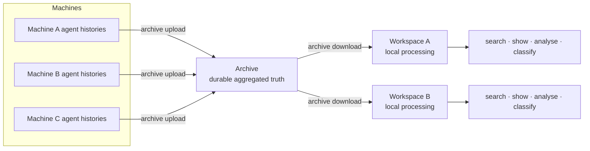
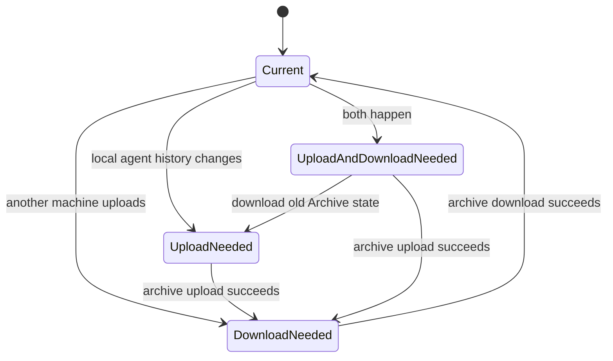
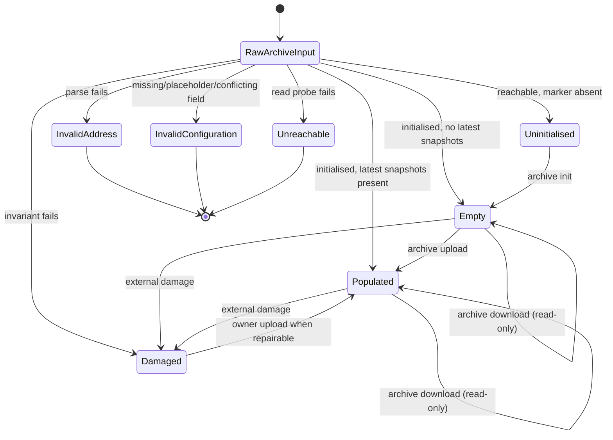
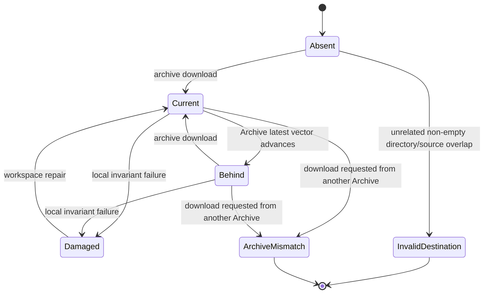
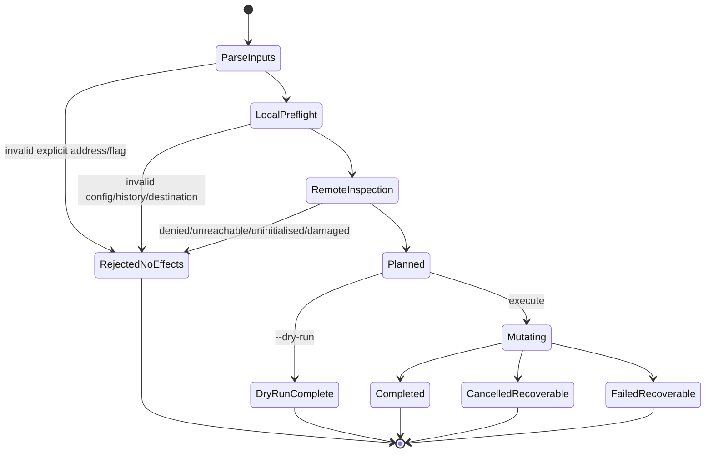

# aha 0.2 Archive and Workspace state-machine plan

Status: **accepted product model; implementation deliberately deferred until the model is reviewed**

Compatibility policy: **none** — aha has not launched and has no users. Version 0.2 will remove the old command/config vocabulary rather than preserve aliases.

Target product version: **0.2.0**

## 1. Product model

Aha has two managed resources and one external input:

1. **Agent histories** — mutable files owned by Pi, Claude Code, Codex, and OpenCode. Aha reads them but never manages or modifies them.
2. **Archive** — durable, private, aggregated history from one or many machines. An Archive may be a local directory or an R2 bucket. It is authoritative for recovery.
3. **Workspace** — one local materialisation of an Archive's selected latest snapshots, prepared for search and processing. It is rebuildable and never authoritative for raw archived history.



The transfer direction is intentionally asymmetric:

```text
Agent histories → Archive → Workspace
```

Workspace processing never flows back into the Archive implicitly. If processing outputs later need sharing, they must become a separately designed artefact type and explicit operation.

## 2. Why Archive, not Depot

**Archive** communicates:

- durable retention;
- historical authority;
- recovery value;
- aggregation across machines;
- local or remote backing without changing the model.

**Depot** suggests a temporary transit or staging location. That conflicts with immutable content-addressed history, historical manifests, and the no-GC retention policy.

The implementation may retain `depot` package names temporarily during refactoring, but public commands, config, JSON, errors, and documentation use **Archive** only.

## 3. What a Workspace is

A Workspace is not a byte-for-byte mirror of an Archive. It materialises a selected Archive view—by default, each machine's latest complete snapshot—plus derived local processing state:

```text
Archive latest vector
  machine-a → sha-A2
  machine-b → sha-B4

Workspace materialised vector
  machine-a → sha-A1
  machine-b → sha-B4
```

The Workspace is behind because machine A differs.

Formally:

```text
Workspace is current
⇔
for every machine in Archive.latest,
Workspace.materialised[machine] == Archive.latest[machine]
```

A Workspace persists:

- Archive identity and address identity;
- materialised machine/snapshot vector;
- Workspace schema version;
- raw content required for evidence reads;
- SQLite/FTS and future derived processing state.

A Workspace bound to Archive A cannot silently download from Archive B. Rebinding requires a separately designed backup-preserving transition; it is not part of 0.2.

## 4. The two observable gaps

The system has two independent lag dimensions:

```text
Agent histories ───────▶ Archive ───────▶ Workspace
              upload gap        download gap
```

### Upload gap

Does the Archive contain this machine's current agent-history state?

```text
unchanged since latest Archive snapshot → uploaded/current
changed or never uploaded              → upload needed
```

### Download gap

Does the Workspace materialize the Archive's selected latest vector?

```text
Workspace vector == Archive vector → current
Workspace vector != Archive vector → download needed
```

Combined system states:



There is deliberately no `sync` command in 0.2. Upload and download are explicit independent transitions. Users may compose them in a shell only when that is their intent:

```bash
aha archive upload && aha archive download
```

Removing `sync` avoids an atomicity fiction and the `UploadCommittedDownloadPending` partial state from the public command surface.

## 5. Final 0.2 command surface

### Archive lifecycle and transfer

```bash
aha archive init [ARCHIVE]
aha archive set-default ARCHIVE
aha archive status [ARCHIVE]
aha archive upload [ARCHIVE]
aha archive download [ARCHIVE] --workspace PATH
aha archive verify [ARCHIVE] [--deep]
```

### Workspace lifecycle and integrity

```bash
aha workspace set-default PATH
aha workspace status [PATH]
aha workspace verify [PATH] [--repair-fts]
aha workspace repair [PATH] --backup
aha workspace conflicts [PATH]
```

### Whole-system inspection and processing

```bash
aha status [--archive ARCHIVE] [--workspace PATH]
aha search [--workspace PATH] QUERY
aha show [--workspace PATH] REF
aha analyse failures [--workspace PATH]
aha dashboard [--workspace PATH]
aha mcp check [--workspace PATH]
aha mcp serve [--workspace PATH]
```

### Initial local setup

```bash
aha init --acknowledge-raw-history
```

`aha init` writes config, assigns a stable machine ID, configures agent-history roots, initialises the default local Archive, and prepares the default Workspace destination. The first Archive download creates the Workspace database/materialisation.

## 6. Commands deliberately removed

| Removed command/term | Replacement/reason |
|---|---|
| `snapshot` | `archive upload`; snapshot remains a domain noun |
| `refresh` | no replacement; explicit upload then download |
| no-path `ingest` | `archive download` |
| bundle-taking `ingest`, `export`, portable bundles | deferred; direct Workspace import violates Archive authority |
| `depot` | `archive` |
| `corpus` | `workspace` |
| `doctor` | unified read-only `status` |
| `read` | `show`; displays contextual evidence for a reference |
| `incidents` | `analyse failures`; names the processing job |
| top-level `conflicts` | `workspace conflicts`; it is a Workspace integrity concern |
| `serve` | `dashboard`; names the user-facing result |
| bare `mcp` | explicit `mcp check` and `mcp serve` |
| top-level `verify` | `archive verify` or `workspace verify` |
| `sync` | removed to avoid hidden composition/partial completion |
| `snapshots`/`ls` command | folded into `archive status` |
| `optimise`/`vacuum` command | removed from public lifecycle; automatic/internal maintenance |
| `rebuild` command name | `workspace repair --backup` |
| `--depot` | `--archive` |
| `--corpus`, `--repo` | `--workspace` |
| `--accept-secrets` | `--acknowledge-raw-history` |
| `archive select` | `archive set-default`; says exactly what local config changes |

No compatibility aliases or deprecation period are planned.

## 7. Why the retained commands remain

### `archive init` — retain

Initialisation is a real durable state transition:

```text
reachable uninitialised location
  → write Archive marker/index
  → initialised empty Archive
```

Upload/download must not auto-initialise. An uninitialised Archive returns one explicit next transition: `aha archive init ARCHIVE`.

R2 bucket creation remains external. Ordinary object credentials do not imply bucket-administration authority.

### Portable import/export — defer

Direct Workspace import would create history absent from the authoritative Archive and make Workspace repair lossy. A coherent portable flow would require paired `archive export`/`archive import`, including explicit same-machine latest-pointer semantics. That journey and state model are deferred beyond 0.2 rather than exposing an authority-breaking shortcut.

### `verify` — retain, resource-scoped

Quick invariant inspection belongs in `archive status` and `workspace status`. Explicit verification remains because deep integrity checks are expensive and because Workspace repair may be inappropriate or undesired.

```bash
aha archive verify --deep
aha workspace verify
aha workspace verify --repair-fts
```

### `workspace repair` — retain instead of rebuild

Users care that the Workspace is repaired, not that one implementation strategy rebuilds it. The transition remains backup-preserving:

```text
Damaged Workspace
  → lock
  → materialize sibling replacement from Archive
  → verify and sync replacement
  → atomic exchange
  → preserve old Workspace as backup
  → Current Workspace
```

### `sync` — remove

It is only shorthand for two valid commands and introduces a partial-completion state. With no users, the simpler explicit lifecycle wins.

### `snapshots` — remove as a command

Archive status includes machine/latest rows and aggregate historical counts. Detailed historical browsing can be introduced later only when there is a concrete user journey.

### `optimise` — remove

SQLite vacuum/optimisation is implementation maintenance, not a primary product transition. It should be automatic, internal, or introduced later under an explicitly advanced maintenance surface if evidence demands it.

## 8. Archive operation contracts

### `archive status`

Read-only. It answers:

- address/config validity;
- credential field/reason state without values;
- reachability;
- initialised/empty/populated/damaged state;
- default-Archive status;
- machines and each latest snapshot;
- aggregate historical manifest/blob counts when cheaply available;
- optional Workspace relationship;
- one next transition or `null`.

It replaces setup, doctor Archive diagnostics, list, and metadata-only verification.

### `archive init`

Required state: reachable and uninitialised.

Writes only marker/index initialisation state. It neither uploads agent history nor changes the default Archive; `archive set-default` is a separate local-config transition.

Postcondition: initialised empty Archive.

### `archive set-default`

Required state: initialised, healthy Archive.

Writes local config only. The name states the exact effect; it never changes Archive contents. `workspace set-default` provides the symmetric local preference for processing commands.

### `archive upload`

```text
read local agent histories
  → compare with this machine's Archive latest
  → upload unknown content-addressed blobs
  → publish immutable manifest
  → conditionally advance this machine's latest pointer/index
```

Preflight displays safe observable scope:

```text
Archive
machine ID
agent-history roots and discovered file counts
new/existing/carried blobs
```

It never opens or changes a Workspace.

Postcondition:

```text
Archive.latest[this machine] == published snapshot
```

### `archive download`

```text
read Archive marker/index/latest vector
  → prove Workspace destination ownership
  → compare Archive and Workspace vectors
  → fetch unknown blobs
  → parse/index into Workspace
  → record materialised vector
```

Default scope: every machine's latest complete snapshot. Historical snapshots remain Archive-only.

Preflight reports:

```text
Archive identity
Workspace path/state
machines/latest snapshots selected
unknown blobs and known bytes
historical snapshots excluded
```

It never reads local agent histories and never writes the Archive.

Postcondition:

```text
Workspace.materialised == planned Archive.latest
```

### `archive verify`

Read-only. Quick status already checks marker/index/latest invariants. Explicit verify performs a stable audit; `--deep` downloads and hashes durable blob/history content.

## 9. Archive lifecycle

The default Archive is local configuration, not an Archive lifecycle state.



User-facing states:

```text
invalid_address
invalid_configuration
unreachable
uninitialised
empty
populated
damaged
```

Use `damaged`, not the vague `degraded`, in public output.

## 10. Workspace lifecycle

A Workspace is bound to exactly one Archive identity.



User-facing states:

```text
absent
current
behind
damaged
archive_mismatch
invalid_destination
```

An Archive with zero snapshots can produce `current` with `snapshots: 0`; content count is not a lifecycle state.

## 11. Mutating-command execution lifecycle

Every mutation uses the same construction sequence:



Required postcondition:

```text
state before Mutating
⇒ zero local config, Archive, Workspace, SQLite, lock, or source mutations
```

Effectful code accepts opaque constructed capabilities, never raw strings:

```go
type ReadyArchiveReader interface { /* sealed */ }
type ReadyArchiveWriter interface { /* sealed */ }
type OwnedWorkspaceDestination interface { /* sealed */ }
type UploadPlan interface { /* sealed */ }
type DownloadPlan interface { /* sealed */ }
```

Zero values and externally manufactured implementations cannot authorise effects.

## 12. Status model

`aha status` is the one normal inspection command. It combines agent-history observation, Archive state, and Workspace relationship without mutation.

```json
{
  "schema": "aha.status.v2",
  "version": "0.2.0",
  "agent_history": {
    "state": "upload_needed",
    "machine": "mac.mynet",
    "files": 214
  },
  "archive": {
    "state": "populated",
    "kind": "r2",
    "selected": false,
    "machines": 2,
    "latest_snapshots": 2,
    "historical_manifests": 7
  },
  "workspace": {
    "state": "behind",
    "archive_matches": true,
    "machines_current": 1,
    "machines_behind": 1,
    "sessions": 2844
  },
  "system_state": "upload_and_download_needed",
  "next_action": {
    "command": "aha",
    "args": ["archive", "upload"]
  }
}
```

Impossible combinations such as `state:"current"` with `archive_matches:false` are excluded by closed internal variants and discriminated JSON output.

## 13. Build identity

`aha version --json` must identify the running build, not only the product version:

```json
{
  "version": "0.2.0",
  "commit": "4c482a3",
  "built_at": "2026-07-11T22:40:20Z",
  "dirty": false
}
```

Development builds use linker-injected commit/build metadata with safe fallbacks. This prevents stale installed binaries from masquerading as the current checkout.

## 14. Expected journeys

### First local use

```bash
aha init --acknowledge-raw-history
aha archive upload
aha archive download --workspace "$HOME/.aha/workspace"
aha search 'query'
```

### Upload to an existing shared R2 Archive

```bash
aha archive status 'r2:team-history'
aha archive upload 'r2:team-history'
```

No init/set-default step is required when the Archive already exists and an explicit address is supplied.

### Aggregate every machine locally

```bash
aha archive status 'r2:team-history'
aha archive download 'r2:team-history' \
  --workspace "$HOME/aha-all-history"
aha status \
  --archive 'r2:team-history' \
  --workspace "$HOME/aha-all-history"
```

### Repair local processing state

```bash
aha workspace verify "$HOME/aha-work"
aha workspace repair "$HOME/aha-work" --backup
```

## 15. Implementation sequence

Implementation starts only after this model is accepted.

### Phase 1 — closed state model

1. Add sealed Archive, Workspace, upload/download plan, and status variants.
2. Replace internal `map[string]any` state assembly with typed views.
3. Persist Archive identity and materialised snapshot vector in each Workspace.
4. Derive all next actions from one transition table.
5. Add exhaustive state/command tests and zero-value capability model-gap tests.

Exit: old commands may still call new internals, but all state decisions come from one model.

### Phase 2 — inspection and planning

1. Implement unified `status` and `archive status`.
2. Add exact build identity.
3. Add upload/download dry-run plans with known machine/snapshot/blob/byte counts.
4. Add Workspace Archive-mismatch enforcement.

Exit: every mutating journey can be fully inspected without effects.

### Phase 3 — replace the CLI atomically

1. Implement the final Archive and Workspace command groups.
2. Replace config keys with `archive` and `workspace_dir`.
3. Replace flags with `--archive` and `--workspace`.
4. Remove every old command, flag, alias, error action, JSON field, and documentation reference in the same change.
5. Regenerate command and TypeScript surfaces.

Exit: only 0.2 vocabulary is reachable.

### Phase 4 — journey evidence

1. Run local Archive, existing R2 upload, pull-only aggregation, repeated no-op download, denied credential, unsafe destination, Archive mismatch, cancellation, repair, and deep-verify journeys.
2. Run fake-R2 model tests and the pinned live R2 smoke suite.
3. Verify Linux/Darwin/Windows builds and MCP/HTTP status parity.

Exit: every documented command runs as written and every invalid transition proves zero effects.

## 16. Required tests

- Exhaustively enumerate every `(ArchiveState, operation)` and `(WorkspaceState, operation)` pair.
- Valid transitions produce exactly the declared next state.
- Invalid transitions return typed rejections and zero filesystem/SQLite/config/Archive operations.
- Upload never opens or mutates a Workspace.
- Download never reads agent histories or writes the Archive.
- Repeated upload/download report meaningful no-op outcomes.
- Download defaults to every machine's latest complete snapshot and explicitly reports excluded historical manifests.
- Workspace Archive mismatch is unrepresentable in mutating code.
- `archive status` agrees with unified `status` for the same inspected state.
- Old commands and flags fail as unknown; no compatibility aliases remain.
- Build identity distinguishes stale binaries with the same product version.

## 17. Non-goals for 0.2

- full byte-for-byte Archive mirroring;
- historical-snapshot Workspace browsing;
- Workspace-to-Archive processing-result publication;
- portable bundle import/export until Archive-authoritative semantics are designed;
- Archive deletion or garbage collection;
- semantic/vector search;
- automatic R2 bucket creation with ordinary object credentials;
- credential persistence in aha config;
- fabricated ETAs.

## 18. Definition of done

A user can predict the system from this diagram alone:

```text
Agent histories --archive upload--> Archive --archive download--> Workspace
```

They can answer:

- where durable truth lives;
- what is aggregated across machines;
- what exists locally for processing;
- which operation mutates which resource;
- whether the Workspace is current;
- whether historical snapshots are included;
- what happened after cancellation/failure;
- which exact next transition is valid.

The implementation is complete only when those answers are structural properties of closed states and capabilities, not conventions explained after an error.
