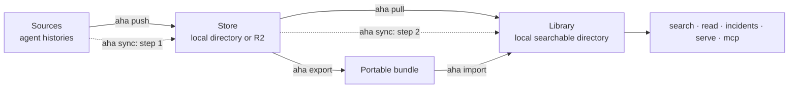
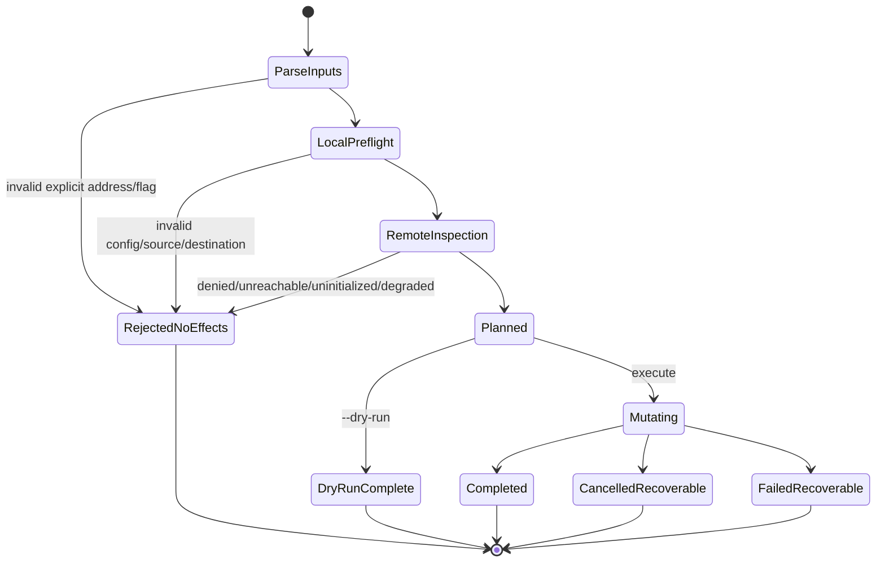
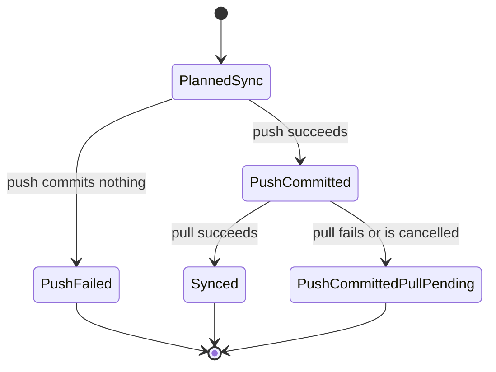

# aha 0.2 command and state-machine redesign

Status: **accepted implementation plan**

Compatibility policy: **none** — aha has not launched and has no users, so 0.2 should remove the old command model rather than preserve aliases.

Target product version: **0.2.0**

## 1. Why redesign now

The multi-machine R2 onboarding session exposed a mismatch between aha's storage implementation and the mental model offered by its CLI:

- the goal “pull every machine into one searchable local folder” required knowing that `ingest` means pull, while `refresh` means push then pull;
- `ingest` also means importing a bundle, an unrelated transition;
- `snapshot` is a push verb disguised as a storage noun;
- `depot use` changes a persistent default, while `--depot` is a one-command override;
- `doctor`, `depot ls`, `depot verify`, and `status --depot` each expose a different fragment of state;
- an old installed binary could not be distinguished from the current checkout because every build reported `0.1.0`;
- a bare bucket name was guessed to be a local path;
- invalid R2 configuration was discovered after a corpus had already been opened;
- safe error presentation removed the field identity needed to correct the environment;
- “all snapshots” could mean every historical manifest or each machine's latest complete snapshot.

PR #15 fixed the immediate construction boundaries. Version 0.2 should make the state machine and vocabulary explicit instead of documenting around the old verbs.

## 2. The 0.2 mental model

Aha has three primary nouns:

1. **Sources** — read-only agent histories on this machine.
2. **Store** — durable raw snapshots, backed by a local directory or R2. A store can be shared by machines.
3. **Library** — one local searchable SQLite/FTS directory assembled from store snapshots.

“Depot” and “corpus” remain implementation terms only. They disappear from the user-facing CLI and JSON contracts.



The verbs are directions:

- **push**: sources → store;
- **pull**: store → library;
- **sync**: push, then pull;
- **import**: portable bundle → library;
- **export**: store snapshot → portable bundle.

A snapshot is a domain object, not a command name.

## 3. Proposed command surface

### Primary workflows

| 0.2 command | Meaning | Replaces |
|---|---|---|
| `aha push [--to STORE]` | Capture this machine and publish its latest complete snapshot. Never opens a library. | `aha snapshot` |
| `aha pull [--from STORE] [--into LIBRARY]` | Pull every machine's latest complete snapshot into one local library. Never reads source roots and never writes the store. | no-path `aha ingest` |
| `aha sync [--with STORE] [--library LIBRARY]` | Push this machine, then pull every machine. Reports partial completion explicitly. | `aha refresh` |
| `aha import BUNDLE... [--into LIBRARY]` | Import portable bundle files only. | path-taking `aha ingest` |
| `aha export --machine ID --out FILE [--from STORE]` | Materialize one machine's latest snapshot as a portable bundle. | renamed flags on `aha export` |

### Store lifecycle

| 0.2 command | Meaning | Replaces |
|---|---|---|
| `aha store init STORE` | Initialize an already-created local directory/R2 bucket and optionally select it. | `aha depot init` |
| `aha store select STORE` | Persist the default store after proving it is initialized and healthy. | `aha depot use` |
| `aha store status [STORE]` | One read-only view of reachability, configuration, initialization, health, machines, latest snapshots, and selection. | `depot setup`, `depot ls`, depot portion of `doctor` |
| `aha store verify [STORE] [--deep]` | Verify marker/index/pointers/manifests; `--deep` verifies blob bytes and history. | `aha depot verify` |

`push` and `sync` do **not** auto-initialize a store in 0.2. An uninitialized store produces a typed state plus the one explicit transition `aha store init STORE`. R2 bucket creation remains external unless a future command receives a separately typed administrative capability.

### Library lifecycle

| 0.2 command | Meaning | Replaces |
|---|---|---|
| `aha library status [LIBRARY]` | Counts, integrity summary, ingested machine/latest vector, and disk use. | corpus portion of `status`, `corpus size` |
| `aha library verify [LIBRARY] [--repair-fts]` | Verify local database/blob/FTS invariants. | `aha verify` |
| `aha library optimize [LIBRARY]` | Vacuum/optimize derived local state. | `aha corpus vacuum` |
| `aha library prune [LIBRARY] --force` | Explicitly prune unreferenced local blobs. | `aha corpus prune-orphans` |
| `aha library rebuild [LIBRARY] --backup` | Durable backup-preserving rebuild. | `aha corpus rebuild` |

### Whole-system inspection

`aha status` becomes the single normal inspection command. It is read-only and accepts optional explicit endpoints:

```bash
aha status \
  --store 'r2:team-history' \
  --library "$HOME/aha-history" \
  --json
```

It reports:

- build/product version;
- configured sources and discovered counts;
- store state and whether it is selected;
- machine IDs and latest manifest identities;
- historical manifest count separately from latest snapshots;
- library state and ingested latest vector;
- per-machine behind/current status;
- one typed next transition, or `null` when current;
- safe configuration field/reason metadata, never values.

`aha doctor` is removed. Unexpected diagnostics belong in `aha status --diagnose`; ordinary onboarding must not require a separate diagnostic mental model.

### Retrieval and serving

`search`, `read`, `incidents`, `conflicts`, `serve`, and `mcp` remain. They use one flag, `--library`; the misleading `--repo` and implementation-oriented `--corpus` aliases are removed.

### Initialization and privacy

`aha init --acknowledge-raw-history` creates the config, initializes the default local store, and prepares the default library destination. The acknowledgement name states the actual invariant: store snapshots retain raw provenance even when library projections are redacted.

The first local journey becomes:

```bash
aha init --acknowledge-raw-history
aha sync
aha search 'query'
```

## 4. Explicit state model

Selection is configuration, not a store lifecycle state. “Selected” is therefore an orthogonal property in status output.

### 4.1 Store inspection and lifecycle

```mermaid
stateDiagram-v2
    [*] --> RawStoreInput
    RawStoreInput --> InvalidAddress: parse fails
    RawStoreInput --> InvalidConfiguration: address valid; config missing/placeholder/conflicting
    RawStoreInput --> Unreachable: config valid; read probe fails
    RawStoreInput --> Uninitialized: reachable; marker absent
    RawStoreInput --> ReadyEmpty: marker/index valid; no latest snapshots
    RawStoreInput --> ReadyPopulated: marker/index/latest vector valid
    RawStoreInput --> Degraded: marker/index/pointer/manifest invariant fails

    Uninitialized --> ReadyEmpty: store init
    ReadyEmpty --> ReadyPopulated: push
    ReadyPopulated --> ReadyPopulated: push new latest
    ReadyEmpty --> Degraded: external damage
    ReadyPopulated --> Degraded: external damage
    Degraded --> ReadyPopulated: owner re-push when repairable

    InvalidAddress --> [*]
    InvalidConfiguration --> [*]
    Unreachable --> [*]
```



Closed Go variants should represent this result, rather than maps containing combinations of `ok`, `initialized`, `error`, and `problems`:

```go
type StoreState interface { storeState() }
type InvalidStoreAddress struct { /* safe reason only */ }
type InvalidStoreConfig struct { Field ConfigField; Reason ConfigReason }
type UnreachableStore struct { Class ReachabilityClass }
type UninitializedStore struct { Target InitializableStore }
type ReadyStore struct { Reader StoreReader; Writer StoreWriter; Latest LatestVector }
type DegradedStore struct { Reader StoreReader; Problems []StoreProblem }
```

Only `ReadyStore` can construct push/pull plans. Only `UninitializedStore` can initialize. Raw addresses and generic `*V2` handles do not reach mutation code.

### 4.2 Library lifecycle

```mermaid
stateDiagram-v2
    [*] --> RawLibraryInput
    RawLibraryInput --> InvalidDestination: overlaps source or unrelated non-empty directory
    RawLibraryInput --> Absent: valid dedicated path; not created
    RawLibraryInput --> Empty: owned library; zero snapshots
    RawLibraryInput --> Current: ingested latest vector equals store latest vector
    RawLibraryInput --> Behind: store latest vector has unknown identities
    RawLibraryInput --> Degraded: SQLite/blob/FTS invariant fails

    Absent --> Empty: initialize library
    Empty --> Current: successful pull
    Current --> Behind: store publishes a newer latest
    Behind --> Current: successful pull
    Empty --> Degraded: local damage
    Current --> Degraded: local damage
    Behind --> Degraded: local damage
    Degraded --> Current: verified rebuild from ready store

    InvalidDestination --> [*]
```



A library stores an **ingested latest vector** keyed by machine ID. This makes “current” precise:

```text
current ⇔ for every machine in store.latest,
          library.snapshots contains store.latest[machine]
```

Historical store manifests are not implicitly pulled. Status reports them separately so “latest complete snapshots” cannot be confused with “every historical snapshot version.”

### 4.3 Command execution lifecycle

Every mutating command follows the same state machine:



Required postcondition:

```text
state ∈ {ParseInputs, LocalPreflight, RemoteInspection, RejectedNoEffects}
⇒ zero local and remote mutations
```

Planning returns typed capabilities:

```go
type PushPlan struct { Sources ReadableSources; Store WritableReadyStore }
type PullPlan struct { Store ReadableReadyStore; Library WritableLibraryDestination }
type SyncPlan struct { Push PushPlan; PullDestination WritableLibraryDestination }
```

Zero values are invalid and every effectful method rejects them.

### 4.4 Honest sync outcomes

`sync` is composition, not an atomic fiction. A successful push followed by a failed pull must not render as a generic total failure:



The partial outcome includes one next transition: rerun `aha pull`, not rerun the already-committed push blindly.

## 5. Command contracts

| Command | Required constructed state | Writes | Success postcondition |
|---|---|---|---|
| `store status` | explicit/default address | none | one closed `StoreState` |
| `store init` | `UninitializedStore` | marker/index only | `ReadyEmpty` |
| `store select` | `ReadyStore` | config pointer only | selected address equals inspected address |
| `push` | `PushPlan` | store blobs/manifest/latest/index | this machine latest equals published manifest |
| `pull` | `PullPlan` | library blobs/SQLite/FTS | library contains the planned latest vector |
| `sync` | `SyncPlan` | push writes, then library writes | `Synced` or explicit `PushCommittedPullPending` |
| `import` | validated bundles + library destination | library only | every accepted bundle identity recorded |
| `status` | optional inspected store/library/source states | none | coherent system snapshot from one model |

## 6. Status JSON sketch

```json
{
  "schema": "aha.status.v2",
  "version": "0.2.0",
  "sources": {
    "state": "ready",
    "enabled": 3,
    "session_files": 214
  },
  "store": {
    "state": "ready",
    "kind": "r2",
    "selected": false,
    "machines": 2,
    "latest_snapshots": 2,
    "historical_manifests": 7
  },
  "library": {
    "state": "current",
    "machines_current": 2,
    "machines_behind": 0,
    "sessions": 2844
  },
  "next_action": null
}
```

State-specific fields are closed variants in Go and discriminated objects in JSON. Impossible combinations such as `state:"ready"` plus `initialized:false` cannot be emitted.

## 7. Implementation sequence

### Phase 1 — model before commands

1. Add sealed store, library, operation, and sync-outcome variants.
2. Replace internal `map[string]any` state assembly with typed views.
3. Add exhaustive model tests for every state/transition pair.
4. Add model-gap tests proving zero values cannot authorize effects.
5. Derive `next_action` from the transition model, deleting command-specific next-action branches.

Exit criterion: all old commands still work internally, but status/transition decisions come from one typed model.

### Phase 2 — unified inspection

1. Implement `store status`, `library status`, and unified `status`.
2. Compute latest vectors and per-machine behind state without blob downloads.
3. Separate latest and historical manifest counts.
4. Add `--dry-run` plans for push, pull, and sync.

Exit criterion: one command answers the complete state question from this onboarding session.

### Phase 3 — replace the command surface

1. Implement `push`, `pull`, `sync`, and `import` over typed plans.
2. Implement `store` and `library` command groups.
3. Rename `--depot`→`--store`, `--corpus`/`--repo`→`--library`.
4. Remove `snapshot`, `refresh`, `ingest`, `depot`, `corpus`, `doctor`, and their aliases in the same change.
5. Regenerate CLI docs and TypeScript surfaces from the registry.

Exit criterion: only the 0.2 vocabulary appears in help, docs, JSON schemas, errors, and next actions.

### Phase 4 — journeys and release evidence

1. Rewrite onboarding around the five directional verbs.
2. Run local-first, existing-R2 pull, contribute-only push, two-machine sync, bundle handoff, denied credential, cancellation, and partial-sync journeys.
3. Run fake-R2 model tests and the pinned live R2 smoke suite.
4. Verify Linux/Darwin/Windows builds and MCP/HTTP status parity.

Exit criterion: every documented command is executable as written and every state transition has a deterministic oracle.

## 8. Required tests

### Exhaustive state-machine tests

Enumerate every `(state, command)` pair:

- valid transitions must produce the declared next state;
- invalid transitions must return a typed rejection;
- all preflight rejections must leave filesystem, SQLite, store operation log, and config unchanged;
- zero-value capabilities must fail before effects;
- cancellation at each effect boundary must leave a valid recoverable state;
- `sync` must distinguish `PushFailed`, `Synced`, and `PushCommittedPullPending`.

### Public journey tests

1. `init → sync → search → read` on one machine.
2. `pull --from r2:... --into ...` on a machine with no sources.
3. Two machines push; a third library pulls both.
4. Repeated pull is a no-op with an explicit “already current” summary.
5. Bare store address, placeholder credential, denied remote, and unrelated library directory all produce zero effects and exact safe corrections.
6. `status` agrees with `store status` and `library status` from the same state.
7. Old command names fail as unknown commands; no compatibility aliases remain.

## 9. Non-goals for 0.2

- semantic/vector search;
- depot garbage collection;
- automatic R2 bucket creation with ordinary object credentials;
- pulling every historical manifest into the active library;
- credential persistence in aha config;
- fabricated ETAs.

## 10. Definition of done

Version 0.2 is complete when a new user can accurately predict these commands without learning internal storage names:

```bash
aha push --to r2:team-history
aha pull --from r2:team-history --into ~/aha-history
aha sync --with r2:team-history --library ~/aha-history
aha status --store r2:team-history --library ~/aha-history
```

The implementation must make every precondition structural, every partial outcome explicit, every status combination representable by one closed variant, and every preflight rejection side-effect free.
