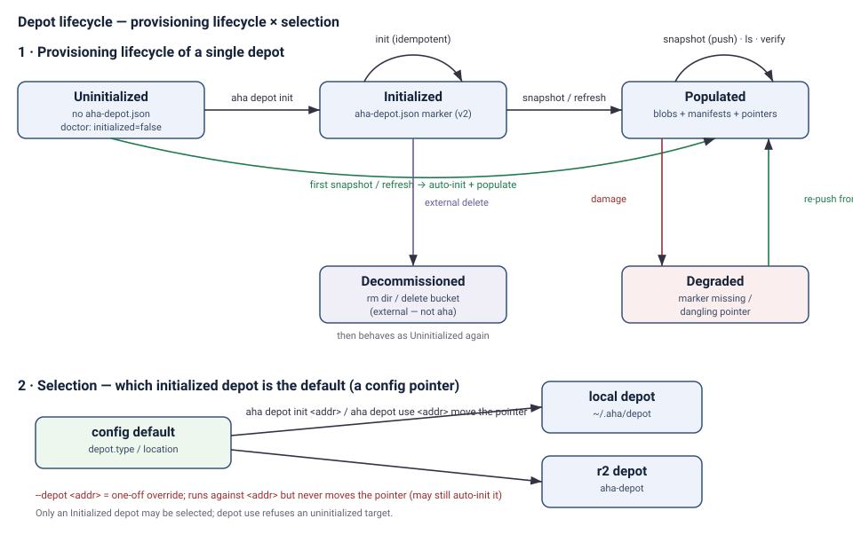

# Depot lifecycle

A **depot** is the durable, content-addressed store for your agent history:
immutable file-version **blobs** plus small per-machine **snapshot manifests**
(docs/depot-v2-spec.md). It sits between your local agent histories and your
local search corpus:

```text
local agent histories → push (blobs + manifest) → depot → pull → local corpus → search/read
```

This document captures a depot's lifecycle: the states it moves through, the
commands that move it, and how the default depot is chosen and switched. For the
on-disk/object layout and per-command data flows see
[`architecture.md`](architecture.md); for first-time R2 setup see
[`onboarding.md`](onboarding.md) §8 and
[`r2-bucket-settings.md`](r2-bucket-settings.md); for full command metadata see
[`commands.md`](commands.md).

## The model in two dimensions

Keeping these two **independent** dimensions separate is the whole model:

- **Provisioning lifecycle of a depot** — its backing store moves through
  **Uninitialized → Initialised → Populated**. `aha` provisions it for you on the
  first write, so you rarely run `aha depot init` by hand.
- **Selection** — exactly one depot is the **default** at a time, recorded as a
  config pointer (`depot.type` / `depot.location`). Out of the box it points at a
  local depot (`~/.aha/depot`) that is not yet provisioned; nothing touches the
  network until you use a remote.

A depot can be fully Initialised and Populated *without* being the default.
*Configuring* a depot moves the pointer — `aha depot init <addr>` (provision and
select) or `aha depot use <addr>` (switch to an already-initialised depot).
CLI addresses are always explicit: `r2:BUCKET` or `local:PATH`; bare values are
rejected rather than guessed. A
`--depot <addr>` flag is a one-off override: it targets a depot for a single
command without moving the pointer (and may still auto-initialise that target).

## State machine



Text version of the diagram:

```text
Provisioning lifecycle of a single depot
----------------------------------------
                aha depot init                  snapshot / refresh
  Uninitialized ───────────────▶ Initialized ────────────────▶ Populated
   (no marker)                    (aha-depot.json marker)        (blobs + manifests + pointers)
        │                          ↺ init (idempotent)           ↺ snapshot · ls · verify
        │  first snapshot / refresh  →  auto-init + populate
        └────────────────────────────────────────────────────────▶ Populated

  Populated ⇄ Degraded   — marker missing / dangling pointer; verify reports it
  any state → (rm dir / delete bucket — external, not aha) → Uninitialized

Selection — which initialized depot is the default (a config pointer)
--------------------------------------------------------------------
  config default ──(aha depot init <addr> | aha depot use <addr>)──▶ { local depot, r2 depot, … }
  --depot <addr>  = one-off override; never moves the pointer (may still auto-init <addr>)
  Only an Initialized depot may be selected; aha depot use refuses an uninitialized target.
```

### Provisioning states

1. **Uninitialized** — the backing store has no `aha-depot.json` marker **and
   no snapshot evidence**: a brand-new local default, or a bucket created in
   the dashboard but never provisioned. `aha doctor` reports it reachable with
   `initialized: false` (`ok: true`) and an `aha depot init ...` next-action
   hint, not as an error. A directory or bucket holding a **v1 depot**
   (`depot.json`) is refused outright: there is no migration; recover old
   bundles via `aha ingest <bundle>`.
2. **Initialised** — the `aha-depot.json` marker is present
   (`schema: aha-depot/v2`, `layout: v2`). Reached by `aha depot init` **or
   implicitly by the first `aha snapshot` / `aha refresh`**, which auto-create
   the dir/bucket and marker before writing.
3. **Populated** — at least one machine namespace exists: blobs under
   `blobs/v2/`, a manifest under `machines/<id>/manifests/`, a
   `machines/<id>/latest` pointer, and the machine listed in
   `machines/index.json`.
4. **Degraded** (a sub-state of Initialised/Populated) — snapshot evidence
   exists but the marker is missing, a pointer dangles, a manifest fails its
   identity check, or a referenced blob is absent. `aha depot verify` reports
   it (`--deep` also verifies blob content and historical manifests). Because
   every object is immutable and write-once, the fix is re-pushing from the
   machine that owns the namespace — there is no repair that could guess at
   content.
5. **Decommissioned** — the backing store was removed **outside `aha`** (`rm`
   the directory, or delete the bucket and revoke its token). A default
   *local* depot then reads as Uninitialized again.

### Selection (orthogonal to the states above)

Selection is **not** a provisioning state — it is the config pointer naming the
default depot. `aha depot init` and `aha depot use` move it (only ever to an
Initialised depot); `--depot <addr>` overrides it for a single command. Switching
the default leaves every depot's data untouched.

## Transitions (commands)

| Command | Provisioning | Selection | Net (r2) | Effect |
|---|---|---|---|---|
| `aha depot setup r2:<bucket>` | read-only preflight | unchanged | yes, after local validation | Rejects malformed/placeholders before networking, reports the depot state, and emits exactly one safe next command. |
| `aha depot init <addr>` | Uninitialized → Initialised (idempotent) | sets default = `<addr>` | yes | Creates the dir/bucket if needed, writes the `aha-depot.json` marker, and for r2 persists the non-secret `depot.r2.account_id`. Re-running against an existing depot just connects. |
| `aha depot use <addr>` | requires Initialised | sets default = `<addr>` | yes | Switches the default to an already-initialised `<addr>`; refuses a reachable-but-uninitialized target and points at `aha depot init`. Persists r2 `account_id`. Creates nothing. |
| `aha snapshot` | Uninitialized → Initialised (auto) → Populated | unchanged | yes | Auto-initialises the target if needed, then pushes: uploads only blobs the parent snapshot does not carry, publishes the manifest, moves the pointer. Unchanged state is recognised from the pointer alone; it performs no blob/manifest/latest writes but repairs missing machine-index registration left by an interrupted first push. Does not touch the corpus and never reads another machine's namespace. |
| `aha refresh` | same as `snapshot` → Populated | unchanged | yes | Push, then pull every machine's latest snapshot into the local corpus, fetching only unknown content. |
| `aha ingest` | reads Populated (no provisioning) | unchanged | yes | Pull-only: anti-entropy the corpus against every machine's latest snapshot. |
| `aha export` | reads Populated | unchanged | yes | Materializes a machine's latest snapshot as one portable v1 `bundle.tar.zst`. |
| `aha depot ls` | reads Initialised/Populated | unchanged | yes | Lists each machine's latest snapshot (identity, capture time, file count). |
| `aha depot verify [--deep]` | reads (reports Degraded) | unchanged | yes | Quick: marker, index, pointers resolve, manifest identities, blob presence. `--deep`: verifies blob content and audits historical manifests. |

Latest-pointer publication carries the canonical machine namespace and expected
parent as an opaque publication token. The store accepts that token only while
the pointer still names that parent (or is still absent for a first push).
Concurrent same-machine writers therefore cannot publish an older prepared
state over the winner; the loser receives a typed retryable stale-publication
error. Shared machine-index updates retain bounded conditional-write retries.

`--depot <addr>` on `snapshot` / `refresh` / `ingest` / `status` / `doctor` runs
that one command against `<addr>` without moving the default pointer. Because the
write commands auto-initialise their target, a one-off `snapshot --depot
r2:other` can create/initialize `r2:other` as a side effect.

## What lives in a depot

```text
<depot>/
  aha-depot.json                                # marker: schema aha-depot/v2
  blobs/v2/<sha256>.zst                         # one compressed file version, write-once
  machines/index.json                           # machine registry (lets pull avoid LIST)
  machines/<machine>/manifests/<sha256>.json    # snapshot manifests, write-once
  machines/<machine>/latest                     # pointer, conditional PUT
```

- **`aha-depot.json`** lets `init` recognise an existing depot and lets
  `verify` check the layout version — the restic repo-config analog.
- **Blobs** are content-addressed file versions, stored once ever; identical
  content across snapshots and machines is one object by construction.
- **Manifests** are logically full (every snapshot lists the machine's whole
  state) and identified by their canonical hash, so snapshots cannot collide
  and a re-push of unchanged state writes nothing.
- **Namespaces** are per-machine: a writer never reads or writes outside its
  own `machines/<id>/` prefix plus the shared blob space and index, so
  machines never contend and contribute-only machines never download.
- The depot **never deletes** (no GC, no retention, no compaction): losing
  history is worse than storing it.

## Walkthrough

### Local (the default)

```bash
aha init --accept-secrets   # writes config with the local depot default
aha refresh                 # auto-initializes ~/.aha/depot, then snapshots + ingests
aha doctor                  # depot: local:~/.aha/depot ok=true, initialized=true
```

No `aha depot init` is needed for the local default — the first `refresh`
provisions it.

### Promote to R2

Configuring R2 makes it the default. Only the two **secret** keys ever live in
the environment; `init` persists the non-secret account id to config:

```bash
# Load real values from a secret manager or shell-neutral interactive prompts.
aha depot setup r2:aha-depot  # read-only; prints one next command
aha depot init r2:aha-depot   # create/connect, write marker, set as default
aha refresh --max-sessions 1  # bounded first push/pull
```

If doctor identifies a pre-v2 local corpus, `aha corpus rebuild --backup`
resolves the corpus to one canonical (symlink-free) identity, acquires a
context-cancellable exclusive lifecycle lock, validates the exact sibling
staging path against every source root, then builds and verifies the
replacement. Replacement files/directories and common-parent metadata are
synced before atomic exchange, and the parent is synced again afterward, so
the configured root is never absent and the old directory remains at the
reported backup path.

### Add another machine

The bucket already exists and is initialised, so the second machine just selects
it (after exporting the two secret keys, plus the account id the first time):

```bash
aha depot use r2:aha-depot
aha refresh                   # shares history through R2
```

### Switch the default back

```bash
aha depot use local:~/.aha/depot   # back to local — both depots keep their data
aha depot use r2:aha-depot         # back to R2
```

## Maintenance

```bash
aha depot ls --json                 # each machine's latest snapshot
aha depot verify --json             # quick: marker, index, pointers, manifests, blob presence
aha depot verify --deep --json      # also verify blob content + historical manifests (slow, explicit)
```

## Decommissioning

Depots are not deleted by `aha`. To stop using one, switch the default away
(`aha depot use <other>`) and then remove the backing store yourself: delete the
local directory, or delete the R2 bucket and revoke its API token. Blobs and
manifests are immutable and content-addressed, so a depot can be safely
abandoned without affecting any corpus already ingested from it.

## Where the configuration lives

- `depot.type` / `depot.location` — the default depot (e.g. `r2` / `aha-depot`).
- `depot.r2.account_id` — non-secret, persisted by `init` / `use` so a configured
  R2 default works in a fresh shell. An explicit `endpoint` (jurisdiction or
  fake-S3) and a non-`auto` `region` are persisted only when set.
- **Never in config:** `AHA_R2_ACCESS_KEY_ID` and `AHA_R2_SECRET_ACCESS_KEY`.
  Keep these two secrets in the environment or a secret manager (a direnv
  `.envrc` is a convenient home).
